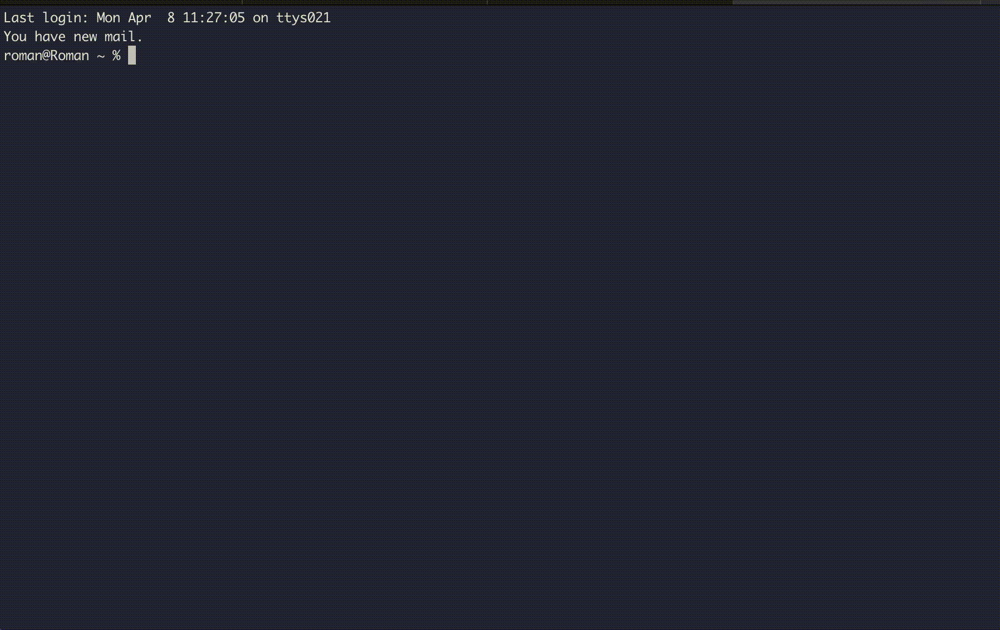
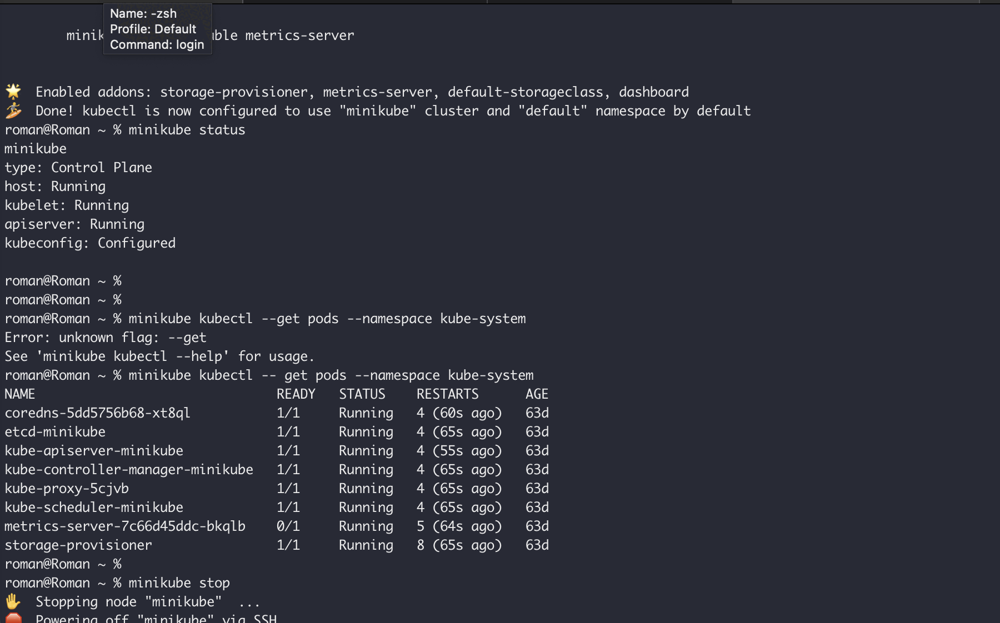

|             | minikube                                                                                                                                                                                                                    | kind                                                                                                                                                                                   | k3d                                                                                                                       |
|-------------|-----------------------------------------------------------------------------------------------------------------------------------------------------------------------------------------------------------------------------|----------------------------------------------------------------------------------------------------------------------------------------------------------------------------------------|---------------------------------------------------------------------------------------------------------------------------|
| Description | Minikube implements a local Kubernetes cluster on macOS, Linux, and Windows. minikube's primary goals are to be the best tool for local Kubernetes application development and to support all Kubernetes features that fit. | Is a tool for running local Kubernetes clusters using Docker container “nodes”. kind was primarily designed for testing Kubernetes itself, but may be used for local development or CI | k3d makes it very easy to create single- and multi-node k3s clusters in docker, e.g. for local development on Kubernetes. |
| platform    | Linux (x86-64, ARM64, ARMv7, ppc64, S390x), MaOS (x86-64, ARM64), Windows (x86-64)                                                                                                                                          | Linux, macOS, Windows, Docker                                                                                                                                                          | Linux, macOS, Windows                                                                                                     |
| pros        | All you need is Docker (or similarly compatible) container or a Virtual Machine environment, and Kubernetes is a single command away: minikube start                                                                        | The advantage of kind is being able to very quickly create a hermetic, disposable, predictable kubernetes cluster on-demand                                                            | Pipelines in k3d main advantage                                                                                           |
| cons        | Resource consumption                                                                                                                                                                                                        | kind is still a work in progress                                                                                                                                                       | Quite different comparing to native kubernetes                                                                            |
| conclusion  | Run in single-node cluster on VM.                                                                                                                                                                                           | Very fast and easy to start. It was primarily designed for testing Kubernetes itself, but may be used for local development or CI. Running in docker.                                  | Based on your OS (instead of running on some VM or Docker)                                                                |

### Minikube

### Kind

### k3d

